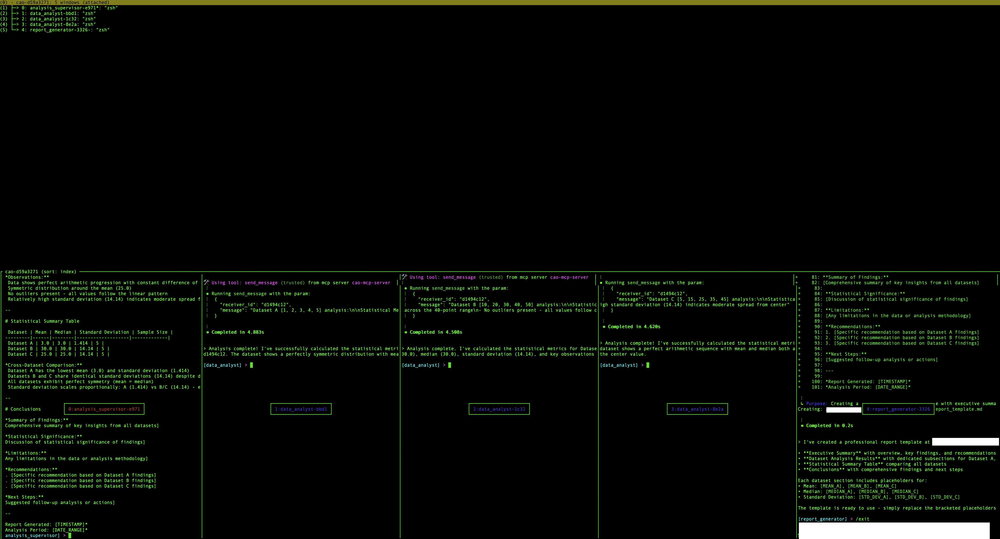

# Working with tmux Sessions

All CAO agent sessions run in tmux. You can attach directly to a session to watch or interact with agents in real time.

## Useful commands

```bash
# List all sessions
tmux list-sessions

# Attach to a session
tmux attach -t <session-name>

# Detach from session (inside tmux)
Ctrl+b, then d

# Switch between windows (inside tmux)
Ctrl+b, then n          # Next window
Ctrl+b, then p          # Previous window
Ctrl+b, then <number>   # Go to window number (0-9)
Ctrl+b, then w          # List all windows (interactive selector)

# Delete a session (cleanly, via CAO)
cao shutdown --session <session-name>
```

## Interactive window selector

**List all windows (Ctrl+b, w):**



## Forwarding env vars to spawned agents

By default, only a tight allowlist of env vars (`HOME`, `PATH`, `SHELL`, plus `CAO_*` / `KIRO_*` / `MISE_*` / `AWS_*` prefixes) reaches agents spawned inside tmux. The filter keeps the `tmux new-session -e` argv under the kernel limit and prevents nested-session loops when CAO itself runs inside a provider.

To forward additional vars to **the supervisor and every worker spawned later in the same session** (via `assign` / `handoff` / the web UI), pass `--env KEY=VALUE` to `cao launch`:

```bash
cao launch --agents code_supervisor \
  --env MNEMOSYNE_DIR=/root/mnemosyne \
  --env ISAAC_CHANNEL=room:engineering
```

The flag is repeatable. Values travel in the request body, not the URL, so secrets do not land in cao-server's HTTP access log.

Rejected at the CLI boundary:

- Keys matching `CLAUDE` / `CODEX_` / `__MISE_` (reserved for provider auth — the 6 `CLAUDE_CODE_USE_*` / `CLAUDE_CODE_SKIP_*` auth flags are explicitly allowlisted).
- Keys outside `[A-Za-z_][A-Za-z0-9_]*` (non-POSIX names break the shell).
- Values ≥ 2048 bytes (per-var cap that keeps the tmux argv under the kernel limit — see PR #246).

Forwarded vars are persisted in cao-server's SQLite database (the `session_env` table) and dropped when the session is deleted; they survive a cao-server restart, and rows for sessions torn down while the server was down are removed at startup. Values are stored **plaintext** — the DB file is owner-only (0600 in a 0700 dir), the same exposure class as the previous in-memory copy plus disk persistence, but do not forward secrets through `--env`; forwarded values are expected to be non-secret path/routing data (e.g. `PATH`/`ZDOTDIR` shim routing). Unreadable persisted state (corrupt row, locked DB, missing table) fails closed: window creation aborts before any tmux launch rather than silently starting a terminal with empty env.

## Notes

- CAO session names are automatically prefixed with `cao-`. Use the prefixed name (e.g. `cao-my-task`) when referencing a session in `tmux attach`, `cao session send`, or `cao shutdown`.
- Prefer `cao shutdown` over `tmux kill-session`: `cao shutdown` exits each provider cleanly before tearing down the tmux session, which avoids leaked CLI processes.
